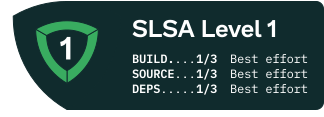

# go-send
A go CLI app for sending emails using Microsoft Graph API




## export enviroment variables
```
export CLIENT_ID=< ID >
export TENANT_ID=< ID >
export CLIENT_SECRET=< SECRET >
```
## Run the app
```
./appname -to="mail@example.com" -from="mail@example.com" -subject="Example Subject" -message="Example Message"
```
## Send Alert to Ms Teams channel
```
./appname -to="mail@example.com" -from="mail@example.com" -subject="Example Subject" -message="Example Message" --channel=true
```
> [!NOTE]  
> The flag channel is "false" by default
